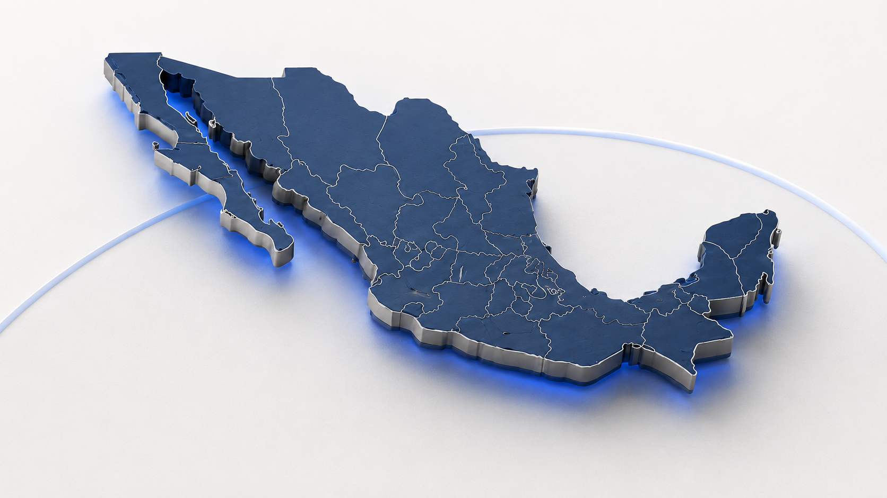
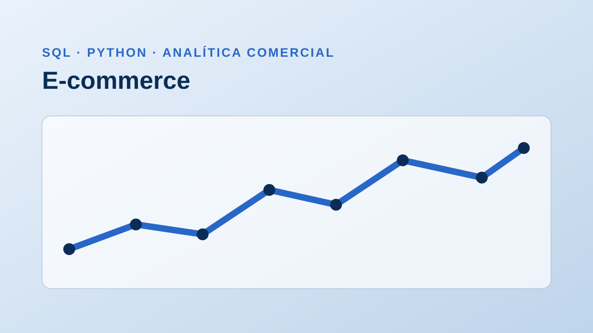

```{=html}
<div class="portfolio-page">

<section id="inicio" class="landing-hero">
  <div class="site-shell landing-hero__grid">
    <div class="landing-hero__copy">
      <p class="eyebrow">ANÁLISIS DE DATOS · BUSINESS INTELLIGENCE</p>
      <h1>Hola, soy<br><strong>David González.</strong></h1>
      <p class="landing-hero__role">Analista de Datos, BI y Estadística</p>
      <p class="landing-hero__description">
        Desarrollo proyectos que transforman datos complejos en indicadores,
        visualizaciones y conclusiones útiles para tomar decisiones.
      </p>

      <div class="landing-hero__actions">
        <a class="button-dark" href="#portafolio">
          Ver proyectos <i class="bi bi-arrow-down" aria-hidden="true"></i>
        </a>
        <a class="button-text" href="https://github.com/DavidGMtz">
          GitHub <i class="bi bi-arrow-up-right" aria-hidden="true"></i>
        </a>
      </div>

      <div class="landing-hero__social" aria-label="Perfiles profesionales">
        <a href="https://www.linkedin.com/in/david-gonzalez-martinez-5729b7272" aria-label="LinkedIn"><i class="bi bi-linkedin" aria-hidden="true"></i></a>
        <a href="https://github.com/DavidGMtz" aria-label="GitHub"><i class="bi bi-github" aria-hidden="true"></i></a>
      </div>
    </div>

    <div class="landing-hero__visual landing-hero__visual--placeholder">
      
    </div>
  </div>
</section>

<section class="positioning-section">
  <div class="site-shell positioning-grid">
    <p class="section-index">01 — ENFOQUE</p>
    <div>
      <h2>Del dato a una decisión comprensible.</h2>
      <p>
        Cada caso muestra el problema, el proceso analítico, las herramientas utilizadas
        y la forma en que los resultados se convierten en información accionable.
      </p>
    </div>
  </div>
</section>

<section id="portafolio" class="portfolio-section">
  <div class="site-shell">
    <div class="portfolio-heading">
      <div>
        <p class="section-index">02 — TRABAJO SELECCIONADO</p>
        <h2>Portafolio</h2>
      </div>
      <p>Proyectos de Business Intelligence, análisis estadístico y visualización de datos.</p>
    </div>

    <article id="pef" class="project-showcase project-showcase--text-first">
      <div class="project-showcase__copy">
        <p class="project-number">PROYECTO 01 · POWER BI</p>
        <h3>Presupuesto de Egresos de la Federación 2026</h3>
        <p class="project-lead">
          Dashboard ejecutivo para explorar la concentración, distribución y seguimiento
          del gasto público en México.
        </p>

        <dl class="project-details">
          <div><dt>Pregunta</dt><dd>¿Dónde se concentra el presupuesto?,   ¿quién administra los recursos?,¿En que se gasta?, ¿Como se financia el gasto?</dd></div>
          <div><dt>Solución</dt><dd>Indicadores, comparativos territoriales y navegación ejecutiva.</dd></div>
          <div><dt>Herramientas</dt><dd>Power BI, Power Query, DAX</dd></div>
        </dl>

      </div>

      <a
        class="project-showcase__media project-showcase__media--dark"
        href="proyectos/pef-2026/"
        aria-label="Consultar el proyecto Presupuesto de Egresos de la Federación 2026">
        
        <span class="project-showcase__overlay">
          <span>Consultar proyecto <i class="bi bi-arrow-right" aria-hidden="true"></i></span>
        </span>
      </a>
    </article>

    <article id="vacantes" class="project-showcase project-showcase--media-first">
      <a
        class="project-showcase__media"
        href="proyectos/vacantes/"
        aria-label="Consultar el proyecto Analítica de cobertura y vacantes">
        
        <span class="project-showcase__overlay">
          <span>Consultar proyecto <i class="bi bi-arrow-right" aria-hidden="true"></i></span>
        </span>
      </a>

      <div class="project-showcase__copy">
        <p class="project-number">PROYECTO 02 · LOOKER STUDIO</p>
        <h3>Analítica de cobertura y vacantes</h3>
        <p class="project-lead">
          Reporte para medir la cobertura de plantilla, localizar la concentración de
          vacantes y priorizar posiciones que requieren atención.
        </p>

        <dl class="project-details">
          <div><dt>Pregunta</dt><dd>¿Qué áreas presentan mayor vacancia y riesgo operativo?</dd></div>
          <div><dt>Solución</dt><dd>Indicadores, filtros y vistas de detalle por posición.</dd></div>
          <div><dt>Herramientas</dt><dd>Looker Studio, Google Sheets,Campos calculados.</dd></div>
        </dl>

      </div>
    </article>

    <article id="ecommerce" class="project-showcase project-showcase--text-first">
      <div class="project-showcase__copy">
        <p class="project-number">PROYECTO 03 · SQL Y PYTHON</p>
        <h3>Análisis comercial E-commerce</h3>
        <p class="project-lead">
          Caso analítico para estudiar ingresos, clientes recurrentes y desempeño de
          productos con un enfoque comercial.
        </p>

        <dl class="project-details">
          <div><dt>Pregunta</dt><dd>¿Qué productos, clientes y periodos explican los ingresos?</dd></div>
          <div><dt>Solución</dt><dd>Consultas, segmentación, tendencias y visualizaciones.</dd></div>
          <div><dt>Herramientas</dt><dd>SQL · Python · pandas</dd></div>
        </dl>

      </div>

      <a
        class="project-showcase__media"
        href="proyectos/ecommerce/"
        aria-label="Consultar el proyecto Análisis comercial E-commerce">
        
        <span class="project-showcase__overlay">
          <span>Consultar proyecto <i class="bi bi-arrow-right" aria-hidden="true"></i></span>
        </span>
      </a>
    </article>
  </div>
</section>

<section id="herramientas" class="capabilities-section">
  <div class="site-shell">
    <div class="section-heading-row">
      <p class="section-index">03 — HERRAMIENTAS</p>
      <h2>Herramientas que manejo</h2>
    </div>

    <div class="tools-grid" aria-label="Herramientas y tecnologías">
      <article class="tool-card">
        <div class="tool-card__logo tool-card__logo--generic">
          <i class="bi bi-database" aria-hidden="true"></i>
        </div>
        <h3>SQL</h3>
        <ul>
          <li>Consultas y filtros</li>
          <li>JOIN y agregaciones</li>
          <li>Limpieza de datos</li>
        </ul>
      </article>

      <article class="tool-card">
        <div class="tool-card__logo">
          
        </div>
        <h3>Power BI</h3>
        <ul>
          <li>Power Query</li>
          <li>DAX y modelado</li>
          <li>Dashboards interactivos</li>
        </ul>
      </article>

      <article class="tool-card">
        <div class="tool-card__logo">
          
        </div>
        <h3>Looker Studio</h3>
        <ul>
          <li>Conexión a fuentes de datos</li>
          <li>Campos calculados y filtros</li>
          <li>Diseño de dashboards</li>
        </ul>
      </article>

      <article class="tool-card">
        <div class="tool-card__logo">
          
        </div>
        <h3>Excel</h3>
        <ul>
          <li>Funciones avanzadas</li>
          <li>Tablas dinámicas</li>
          <li>Macros y VBA</li>
        </ul>
      </article>

      <article class="tool-card">
        <div class="tool-card__logo tool-card__logo--python">
          
        </div>
        <h3>Python</h3>
        <ul>
          <li>pandas y NumPy</li>
          <li>Matplotlib y Seaborn</li>
          <li>statsmodels</li>
        </ul>
      </article>
    </div>
  </div>
</section>

<section id="contacto" class="contact-section">
  <div class="site-shell contact-grid">
    <div>
      <p class="section-index">04 — CONTACTO</p>
      <h2>¿Hablamos de datos?</h2>
    </div>
    <div class="contact-copy">
      <p>
        Puedes consultar mi código, conocer mi perfil profesional o descargar mi CV.
        Los enlaces definitivos se incorporarán en la siguiente revisión.
      </p>
      <div class="contact-links">
        <a class="button-dark" href="https://www.linkedin.com/in/david-gonzalez-martinez-5729b7272">LinkedIn</a>
        <a class="button-outline" href="https://github.com/DavidGMtz">GitHub</a>
        <span class="button-outline button-disabled" aria-disabled="true">Descargar CV</span>
      </div>
    </div>
  </div>
</section>

</div>
```
